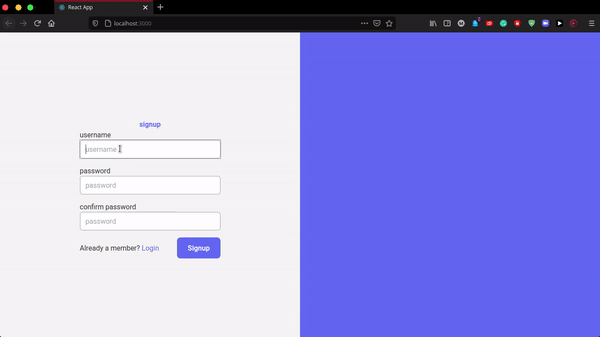

# To Do List App using MERN Stack <!-- omit from toc -->

This is a mern based application where a user login with a username and password and create the to-do list. 


## Run the program

1. run server
   ```
   npm start
   ```

2. run client
   ```bash
    cd client && npm start
   ```


## Demonstartion




## Reference
1. https://www.youtube.com/watch?v=EzF-ul6jv3U